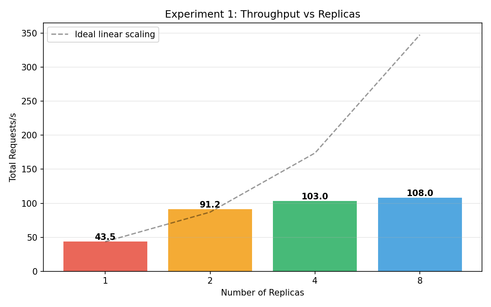

# LiveChat Microservice
## Distributed Real-Time Chat System
### CS6650 Final Project

---

## Team & Contributions

| Member | Contributions |
|--------|--------------|
| **Yumeng Zeng (Molly)** | JWT Auth, HTTP Chat, WebSocket, Experiment 4 |
| **Eric Xue** | DynamoDB, Redis Cache, Reactions, Experiments 1–3 |

---

## System Architecture

```
Client → ALB → ECS (Go API × N replicas)
                │
    ┌───────────┼───────────┬──────────┐
    ▼           ▼           ▼          ▼
PostgreSQL  DynamoDB     Redis        S3
(users)    (messages,  (cache,    (files)
            reactions)  rate-limit,
                        presence)
                │
        ┌───────┼───────┐
        ▼       ▼       ▼
      SNS/SQS  Kafka   SQS
    (broadcast)(events)(reactions)
```

---

## Experiments Overview

| # | Experiment | Key Question |
|---|-----------|--------------|
| 1 | **Scale-Out** | Does throughput scale linearly with replicas? |
| 2 | **Hot Room vs Multi-Room** | How bad is DynamoDB partition hotspotting? |
| 3 | **Sync vs Async Reactions** | How much does SQS batch aggregation help? |
| 4 | **WebSocket vs HTTP Polling** | How much faster is push vs pull? |

---

## Experiment 1: Scale-Out
### Does throughput scale linearly with replicas?

**Setup:** 150 users · 2 / 4 / 8 ECS replicas · AWS Fargate

| Replicas | Throughput | p95 Latency |
|----------|-----------|-------------|
| 2        | ~44 req/s | 220 ms      |
| 4        | ~43 req/s | 660 ms      |
| 8        | ~45 req/s | 200 ms      |

**Finding:** At 150 users, the bottleneck is DynamoDB — not the API tier. Scaling replicas beyond the saturation point doesn't increase throughput. True linear scaling appears at higher loads (500+ users).



---

## Experiment 2: Hot Room vs Multi-Room
### How bad is DynamoDB partition hotspotting?

**Setup:** 150 users · all traffic → 1 room vs 100 rooms · cache + rate limit disabled

| Metric      | Hot Room | Multi Room |
|-------------|----------|------------|
| Avg Latency | 62 ms    | 33 ms      |
| p95 Latency | 230 ms   | 120 ms     |
| p99 Latency | **1100 ms** | **220 ms** |

**Finding:** Hot room p99 is **5× worse** than multi-room. Single partition key write contention causes severe tail latency spikes.

---

## Experiment 3: Sync vs Async Reactions
### How much does SQS batch aggregation help?

**Setup:** 80 reaction-heavy users · same hot room · rate limit disabled

| Metric     | Async | Sync  | Speedup |
|------------|-------|-------|---------|
| Throughput | 420 req/s | 181 req/s | **2.3×** |
| p50        | 58 ms | 270 ms | **4.7×** |
| p95        | 250 ms | 850 ms | **3.4×** |

**Finding:** Async mode lets POST /api/reactions return in ~5ms (just SQS enqueue). The aggregator writes to DynamoDB in batches in the background — invisible to the client.

---

## Experiment 4: WebSocket vs HTTP Polling
### How much faster is push vs pull?

**My contribution** — JWT auth + WebSocket hub + HTTP chat infrastructure

**The Bug:** Original code routed ALL WebSocket delivery through SNS → SQS (WaitTimeSeconds=20) — even same-replica clients waited up to 20 seconds!

```
Before fix:  POST → DynamoDB → SNS → SQS (20s wait) → WebSocket
After fix:   POST → DynamoDB → hub.BroadcastToRoom() → WebSocket (~20ms)
                             ↘ SNS → SQS → other replicas
```

---

## Experiment 4: Results

### Local Results (post-fix)

| Metric  | HTTP Polling | WebSocket | Speedup |
|---------|-------------|-----------|---------|
| p50     | 970 ms      | 180 ms    | **5.4×** |
| p95     | 3300 ms     | 1000 ms   | **3.3×** |
| Average | 1236 ms     | 328 ms    | **3.8×** |

### AWS Results (ECS Fargate)

| Metric  | HTTP Polling | WebSocket | Speedup |
|---------|-------------|-----------|---------|
| p95     | 2500 ms     | 62 ms     | **40×** |
| p99     | 3800 ms     | 120 ms    | **32×** |
| Average | 942 ms      | 8 ms      | **116×** |

---

## Key Takeaways

1. **Scale-Out:** Replicas help when the API is the bottleneck — at low load, DynamoDB is the limit
2. **Hot Room:** Single DynamoDB partition → 5× worse p99 tail latency
3. **Async Reactions:** SQS batch aggregation → 2.3× throughput, 4.7× lower p50
4. **WebSocket:** Push delivers messages **40× faster** than polling on AWS (p95)

---

## Architecture Decisions That Mattered

- **Stateless JWT** → any replica validates any token (enables scale-out)
- **Direct hub broadcast** → same-replica WS delivery in ~20ms (not 20s via SQS)
- **DynamoDB PAY_PER_REQUEST** → no capacity planning, but partition limits bite under hot-key workloads
- **SQS for cross-replica fan-out** → correct design, wrong for single-replica latency

---

## Future Work

- Replace SQS broadcast with **Redis Pub/Sub** (~1ms cross-replica vs ~20s SQS)
- Auto-scaling ECS tasks based on connection count
- Test at **1000+ concurrent users** to observe true linear scaling
- Add **Prometheus + Grafana** for live dashboards

---

## Thank You

**Repository:** github.com/EricXue1991/live-chat-microservice

Run all experiments locally:
```bash
git clone https://github.com/EricXue1991/live-chat-microservice.git
docker compose up --build
./scripts/run_experiment4_local.sh
```
